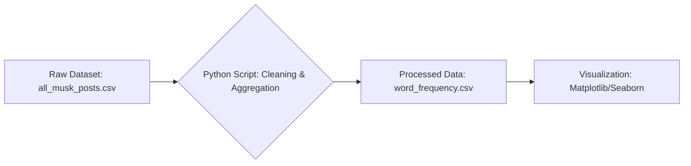

# Decompiling-MuskOS
An NLP analysis of Elon Musk's linguistic patterns on X (formerly Twitter) to uncover his communication strategy.

### Table of Contents
1. [Project Goal](#project-goal)
2. [Getting Started](#getting-started)
3. [Tech Stack & Purpose](#tech-stack--purpose)
4. [Data Processing Workflow](#data-processing-workflow)
5. [Results: Trends Over Time](#results-trends-over-time)
6. [Analysis and Conclusions](#analysis-and-conclusions)
7. [Potential Next Steps](#potential-next-steps)

---

### Project Goal
This project's goal was to create a visual linguistic profile of Elon Musk based on aggregated word frequency data. It aims to humorously and data-drivenly investigate whether his digital footprint paints a picture of a titan of innovation, a king of marketing, or perhaps just a man who really, really likes the word "yeah".

---

### Getting Started
To replicate this analysis, follow these steps. It is recommended to use a virtual environment.

**1. Clone the repository:**
```bash
git clone [https://github.com/your-username/Decompiling-MuskOS.git](https://github.com/your-username/Decompiling-MuskOS.git)
cd Decompiling-MuskOS
```

**2. Install dependencies:**
The required libraries are listed in the `requirements.txt` file.
```bash
pip install -r requirements.txt
```

**3. Download the data:**
The raw dataset is hosted on Google Drive. Download it and place it in the `/data` directory.
**[➡️ Download `all_musk_posts.csv` from Google Drive](https://drive.google.com/file/d/1QsCQF8Zgnrpl_aBAOsHe4YR5LbDs_JAP/view?usp=drive_link)**

**4. Run the analysis:**
Execute the Jupyter Notebook or a corresponding Python script to process the data and generate the final chart.
```bash
# Recommended: Run the notebook for a step-by-step view
jupyter notebook notebooks/musk_tweet_analysis.ipynb
```

---

### Tech Stack & Purpose
| Category | Tools | Purpose |
|---|---|---|
| **Data Sourcing** |   | Sourcing the initial dataset and hosting the large raw file. |
| **Language & Libraries** |   | Core language for scripting; chosen for its efficiency in handling and cleaning large datasets. |
| **Data Visualization** |   | Generating static charts to visualize trends over time. |
| **Work Environment** |  | Rapid prototyping and analysis with GPU support. |
| **Contextual Research** |  | Deep research to provide context for the observed data trends. |

---

### Data Processing Workflow
The project follows a clear data pipeline, transforming raw tweet data into an aggregated, analysis-ready format.

**1. Data Sourcing:**
The raw dataset, `all_musk_posts.csv`, is sourced from Google Drive.

**2. Data Processing:**
The Python script **[`/notebooks/musk_tweet_analysis.ipynb`](/notebooks/musk_tweet_analysis.ipynb)** performs the following steps:
* Loads the raw data into a Pandas DataFrame.
* Cleans and preprocesses the text data.
* Aggregates word counts by year for a predefined list of key terms.

**3. Data Output:**
The script generates a clean, aggregated CSV file named **[`/data/musk_word_frequency_by_year.csv`](/data/musk_word_frequency_by_year.csv)**, which serves as the direct input for the visualization phase.

**Workflow Diagram:**


---

### Results: Trends Over Time
The line chart below was generated from the processed data and illustrates the changing frequency of key terms in Elon Musk's tweets.

)

#### **Final Aggregated Data Sample**
The raw data was processed to produce the following aggregated results, which were used for visualization:

| Year | Term         | Count |
|------|--------------|-------|
| 2017 | coming soon  | 25    |
| 2017 | exactly      | 45    |
| ...  | ...          | ...   |

---

### Analysis and Conclusions

#### **The Main Pillar: "Tesla" – From Startup to Giant**
It's no surprise that **"tesla"** is one of the most frequently used words. The chart shows clear spikes that correlate with key events in the company's history, such as the Model 3 "production hell" (2017-2018) and the explosive stock growth and Gigafactory openings (2020-2022). Musk uses Twitter as his primary channel to communicate progress and manage the brand's public image.

#### **The Public War: Musk vs. "Legacy Media"**
The phrase **"legacy media"** is a weapon in Musk's communication arsenal. Its usage sharply increases during periods when Musk or his companies are under fire, particularly during and after the acquisition of Twitter (X). By labeling critics as "old media," he discredits them in the eyes of his followers, creating an "us versus them" narrative.

#### **The Currency of Conversation: "Yeah," "True," "Exactly"**
These short, affirmative words are the foundation of his interaction style. Their consistently high frequency shows that he uses the platform for conversation, not just announcements. They serve to quickly build agreement, validate his supporters' viewpoints, and create an impression of direct, authentic dialogue, which functions as a powerful engagement mechanism.

#### **The Event Horizon: "Coming Soon" and "Next Year"**
Musk is a master of selling the future. These phrases create a constant sense of anticipation around his projects (FSD, Cybertruck, etc.). This linguistic tool helps sustain high valuations and public interest, which are often based more on his vision than on current results.

#### **Final Verdict: The Linguistic DNA of Elon Musk**
Elon Musk's language on social media is a precisely constructed system based on **promoting a vision**, **building a tribal identity**, and **maintaining engagement** through the appearance of direct dialogue. The data clearly shows that these are not random words, but a conscious and remarkably effective communication strategy.

---

### Potential Next Steps
* **Sentiment Analysis**: Perform sentiment analysis on tweets containing specific keywords (e.g., "Tesla", "legacy media") to quantify the emotional context over time.
* **Topic Modeling (LDA)**: Use topic modeling to automatically discover hidden thematic structures in his communication, beyond predefined keywords.
* **Interactive Dashboard**: Create an interactive dashboard using Plotly Dash or Streamlit to allow users to explore the data and filter by keywords and date ranges.
* **Comparative Analysis**: Compare Musk's linguistic patterns with those of other tech CEOs like Mark Zuckerberg or Tim Cook.
